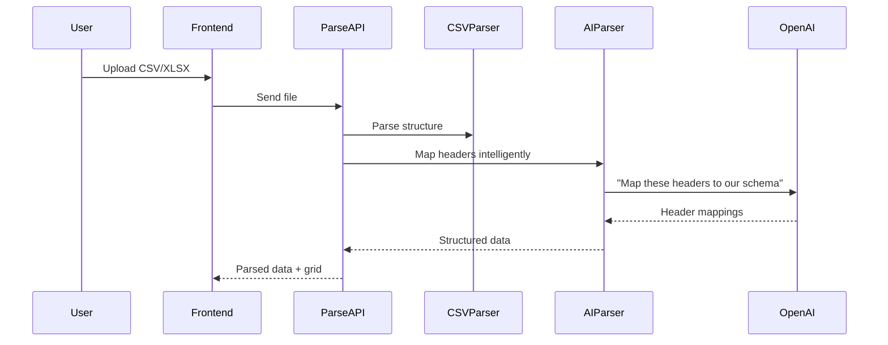
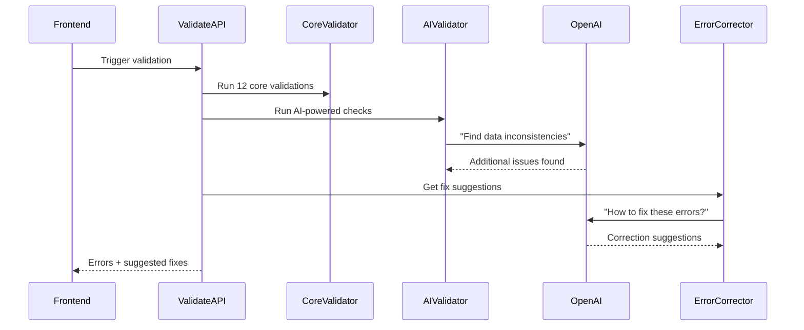

# Data Alchemist - Technical Implementation Guide

## 🏗️ Infrastructure Architecture

### 1. Frontend Architecture (Next.js Client)

```typescript
// Core State Management Structure
interface AppState {
  clients: ClientData[];
  workers: WorkerData[];
  tasks: TaskData[];
  validationErrors: ValidationError[];
  rules: BusinessRule[];
  priorities: PriorityWeights;
  isProcessing: boolean;
}
```

**Key Components:**

- **File Upload Handler**: Drag-drop with progress indicators
- **Data Grid**: Real-time editing with validation highlights
- **Validation Panel**: Live error summary with fix suggestions
- **Rule Builder**: Visual rule creation with AI assistance
- **Priority Controls**: Interactive sliders and drag-drop ranking

### 2. API Routes Structure

```typescript
``

/api/
├── parse/           # File parsing & AI header mapping
├── validate/        # Core + AI validation engine
├── rules/           # Rule CRUD & NL conversion
├── nl-search/       # Natural language data queries
├── export/          # Clean data & rules export
└── ai/              # OpenAI integration endpoints
```

### 3. Data Processing Pipeline

#### Phase 1: Data Ingestion



#### Phase 2: Validation & Correction



## 🤖 AI Integration Strategy

### 1. Smart Data Parser

```typescript
async function aiParseHeaders(rawHeaders: string[], expectedSchema: Schema) {
  const prompt = `
    Map these CSV headers to our data schema:
    Headers: ${rawHeaders.join(", ")}
    Expected: ${Object.keys(expectedSchema).join(", ")}
    
    Return mapping as JSON: {"raw_header": "schema_field"}
  `;

  const response = await openai.chat.completions.create({
    model: "gpt-4",
    messages: [{ role: "user", content: prompt }],
    temperature: 0.1,
  });

  return JSON.parse(response.choices[0].message.content);
}
```

### 2. Natural Language Search

```typescript
async function processNLQuery(query: string, data: TableData) {
  const prompt = `
    Convert this natural language query to data filter:
    Query: "${query}"
    
    Available fields: ${Object.keys(data[0]).join(", ")}
    
    Return JavaScript filter function as string.
  `;

  // Generate and safely execute filter
  const filterCode = await getAIResponse(prompt);
  return data.filter(eval(filterCode));
}
```

### 3. Rule Recommendation Engine

```typescript
async function recommendRules(data: AppData) {
  const patterns = analyzeDataPatterns(data);

  const prompt = `
    Based on these data patterns, suggest business rules:
    ${JSON.stringify(patterns, null, 2)}
    
    Focus on: co-run opportunities, load balancing, constraint violations
  `;

  return await getAIResponse(prompt);
}
```

## 🔧 Core Technical Components

### 1. Validation Engine Architecture

```typescript
interface Validator {
  name: string;
  check: (data: AppData) => ValidationResult[];
  severity: "error" | "warning" | "info";
  autoFix?: (data: AppData) => AppData;
}

const coreValidators: Validator[] = [
  {
    name: "duplicate-ids",
    check: (data) => findDuplicateIds(data),
    severity: "error",
    autoFix: (data) => assignUniqueIds(data),
  },
  {
    name: "missing-references",
    check: (data) => findBrokenReferences(data),
    severity: "error",
  },
  // ... 10 more validators
];
```

### 2. Rule Engine Structure

```typescript
interface BusinessRule {
  id: string;
  type: "coRun" | "slotRestriction" | "loadLimit" | "phaseWindow" | "pattern";
  name: string;
  conditions: any;
  parameters: any;
  priority: number;
  aiGenerated?: boolean;
}

class RuleEngine {
  validateRule(rule: BusinessRule, data: AppData): boolean {
    // Check if rule can be applied to current data
  }

  convertNLToRule(naturalLanguage: string): Promise<BusinessRule> {
    // Use AI to convert plain English to structured rule
  }

  exportRulesConfig(): RulesJSON {
    // Generate final rules.json for downstream systems
  }
}
```

### 3. Export Generation

```typescript
interface ExportPackage {
  cleanedData: {
    clients: ClientData[];
    workers: WorkerData[];
    tasks: TaskData[];
  };
  rulesConfig: RulesJSON;
  validationReport: ValidationSummary;
  priorityWeights: PriorityWeights;
}

async function generateExport(appState: AppState): Promise<ExportPackage> {
  const cleanedData = await cleanAndValidateData(appState);
  const rulesConfig = ruleEngine.exportRulesConfig();

  return {
    cleanedData,
    rulesConfig,
    validationReport: generateSummary(cleanedData),
    priorityWeights: appState.priorities,
  };
}
```

## 📊 Data Flow Sequence

### Complete User Journey

1. **Upload Phase**

   - User drops CSV files
   - AI maps headers intelligently
   - Data displays in editable grids

2. **Validation Phase**

   - Real-time validation on every edit
   - AI suggests fixes for errors
   - Visual highlighting of issues

3. **Rule Building Phase**

   - User creates rules via UI
   - AI converts natural language rules
   - System recommends additional rules

4. **Priority Setting Phase**

   - Interactive weight assignment
   - Preset profiles available
   - Real-time impact preview

5. **Export Phase**
   - Generate clean CSV files
   - Create rules.json config
   - Download complete package

## 🚀 Performance & Scalability

### Client-Side Optimizations

- **Virtual scrolling** for large datasets
- **Debounced validation** for real-time feedback
- **Lazy loading** of AI features
- **Progressive enhancement** for core functionality

### API Optimizations

- **Streaming responses** for large file processing
- **Caching** for AI responses
- **Rate limiting** for AI API calls
- **Error boundaries** for graceful degradation

### Memory Management

- Store data in memory for session
- Clear temporary files after export
- Implement data pagination for huge files

## 🎯 Key Implementation Tips

1. **Start Simple**: Build core validation first, add AI features progressively
2. **Error Handling**: Graceful degradation when AI services are unavailable
3. **User Feedback**: Clear progress indicators for AI operations
4. **Testing Strategy**: Mock AI responses for consistent testing
5. **Performance**: Implement virtual scrolling for large datasets

This architecture provides a solid foundation for your Data Alchemist application with clear separation of concerns and scalable AI integration.
